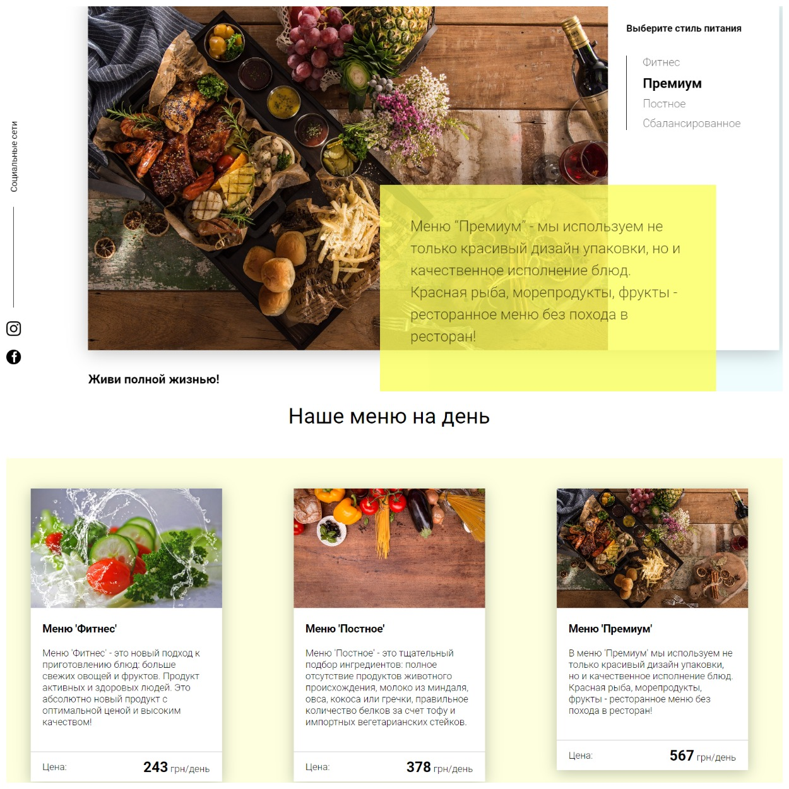
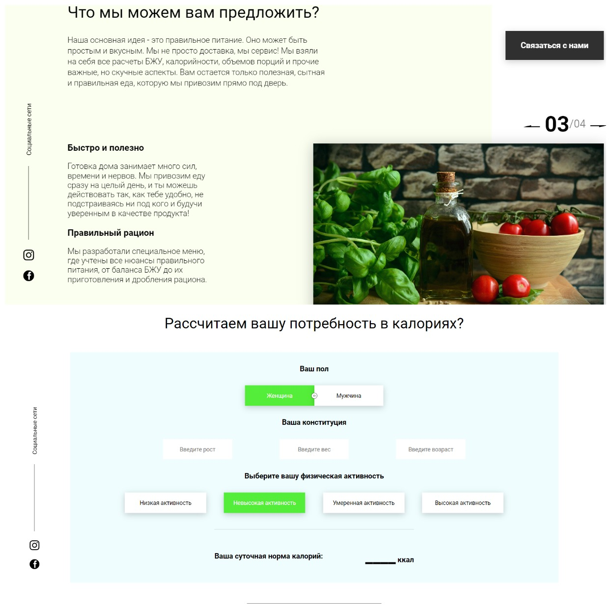

# Special meals for everyone!

🍎Landing page for a company providing special meals.



🍏Designed to familiarize the user with the company's product and help calculate their personal diet.



## Features/highlights

-   landing site example
-   personal calorie calculator
-   user-friendly interface to familiarize the user with the product

## Setup

```bash
$ git clone https://github.com/YuriyDubinin/foodApp.git
$ cd foodApp
$ npm i
$ npx json-server db.json
$ npx webpack
```

## Build

```bash
It is required to set the "production" mode in the settings webpack.config.js

$ npx webpack
```
